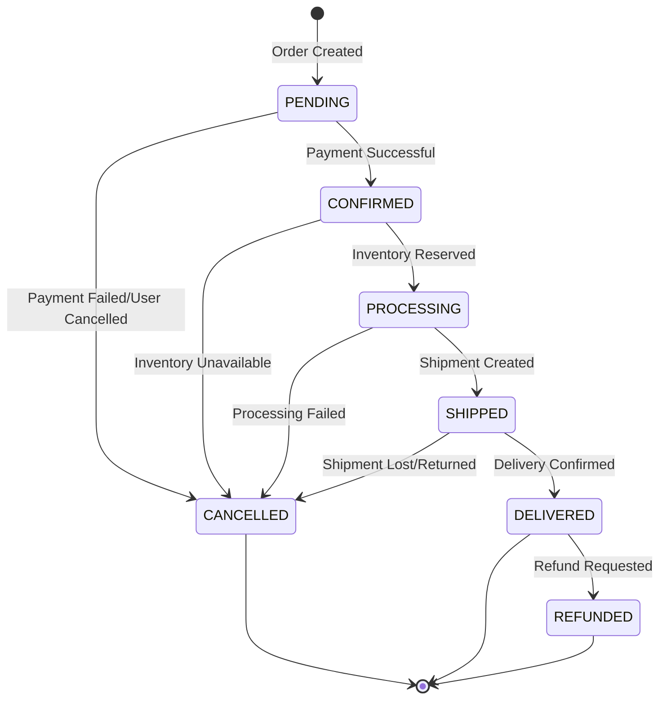
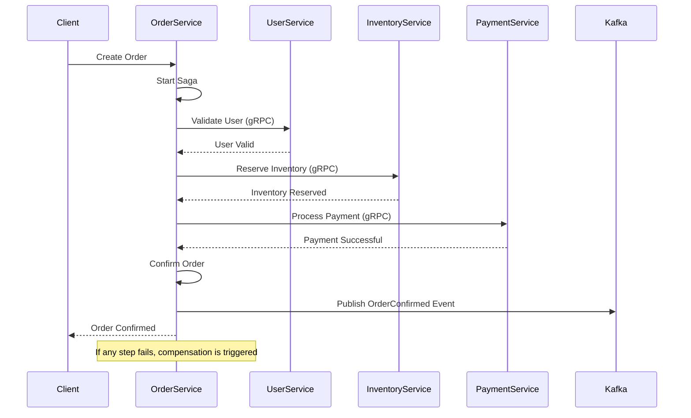

# Order Management Service

## Overview

The Order Management Service is the core of the e-commerce platform's order processing system. It handles order creation, status management, distributed transactions using the Saga pattern, and provides comprehensive idempotency and duplicate prevention mechanisms.

**Port**: 8087 (HTTP), 9087 (gRPC)  
**Technology**: Spring Boot 3.2.x, Spring Data JPA, Kafka, gRPC  
**Database**: MySQL (`order_service` database)  
**Status**: ✅ **Production Ready** (Tasks 17-20 Complete)

## 🚀 Features Implemented

### ✅ Advanced Order Management

- **Order Creation**: Comprehensive order creation with ACID transactions
- **Order Status Management**: State machine-based status transitions
- **Order Validation**: Multi-level validation (user, inventory, payment)
- **Order Calculations**: Automatic tax, shipping, and total calculations
- **Multi-Tenant Isolation**: Complete tenant separation for all order data
- **Order Number Generation**: Collision-resistant unique order number generation

### ✅ Distributed Transaction Management (Saga Pattern)

- **Order Saga Orchestrator**: Coordinates distributed transactions across services
- **Compensation Logic**: Automatic rollback on transaction failures
- **Timeout Handling**: Configurable timeouts for long-running operations
- **Retry Mechanisms**: Exponential backoff retry for transient failures
- **State Persistence**: Saga state tracking for recovery and monitoring

### ✅ Idempotency & Duplicate Prevention

- **Idempotency Token Validation**: Comprehensive token-based duplicate prevention
- **Request Deduplication**: SHA-256 hash-based request content matching
- **Unique Order Numbers**: Collision-resistant order number generation with fallback
- **Rate Limiting**: Per-user and per-tenant rate limiting (10 requests/minute per user)
- **Cached Responses**: Automatic response caching for completed idempotent requests
- **Token Cleanup**: Automatic cleanup of expired idempotency tokens

### ✅ Event-Driven Architecture

- **Kafka Event Publishing**: Comprehensive order lifecycle event publishing
- **Event Sourcing**: Complete audit trail through events
- **Event Replay**: Recovery mechanisms for failed event processing
- **Correlation ID Tracking**: End-to-end request tracing across services
- **Async Processing**: Non-blocking event publishing with error handling

### ✅ gRPC Integration

- **Internal Service Communication**: High-performance gRPC calls to other services
- **Service Clients**: Inventory, Payment, User, and Product service clients
- **Protocol Buffers**: Type-safe, efficient serialization
- **Connection Management**: Connection pooling and health monitoring
- **Error Handling**: Comprehensive gRPC error handling and retry logic

## 🏗️ Architecture

### Database Schema

```sql
-- Orders table with comprehensive indexing
CREATE TABLE orders (
    id BIGINT PRIMARY KEY AUTO_INCREMENT,
    tenant_id VARCHAR(50) NOT NULL,
    order_number VARCHAR(100) NOT NULL,
    user_id BIGINT NOT NULL,
    status ENUM('PENDING', 'CONFIRMED', 'PROCESSING', 'SHIPPED', 'DELIVERED', 'CANCELLED', 'REFUNDED') NOT NULL DEFAULT 'PENDING',
    subtotal DECIMAL(10,2) NOT NULL,
    tax_amount DECIMAL(10,2) NOT NULL,
    shipping_amount DECIMAL(10,2) NOT NULL,
    discount_amount DECIMAL(10,2) NOT NULL DEFAULT 0.00,
    total_amount DECIMAL(10,2) NOT NULL,
    currency VARCHAR(3) NOT NULL DEFAULT 'USD',
    billing_address JSON NOT NULL,
    shipping_address JSON NOT NULL,
    payment_method VARCHAR(50),
    shipping_method VARCHAR(50),
    notes TEXT,
    created_at TIMESTAMP DEFAULT CURRENT_TIMESTAMP,
    updated_at TIMESTAMP DEFAULT CURRENT_TIMESTAMP ON UPDATE CURRENT_TIMESTAMP,
    confirmed_at TIMESTAMP NULL,
    shipped_at TIMESTAMP NULL,
    delivered_at TIMESTAMP NULL,
    cancelled_at TIMESTAMP NULL,
    UNIQUE KEY unique_order_number (order_number),
    INDEX idx_tenant_user (tenant_id, user_id),
    INDEX idx_status (status),
    INDEX idx_created_at (created_at),
    INDEX idx_tenant_id (tenant_id)
);

-- Order items with product snapshot
CREATE TABLE order_items (
    id BIGINT PRIMARY KEY AUTO_INCREMENT,
    order_id BIGINT NOT NULL,
    product_id VARCHAR(100) NOT NULL,
    sku VARCHAR(100) NOT NULL,
    product_name VARCHAR(255) NOT NULL,
    quantity INT NOT NULL,
    unit_price DECIMAL(10,2) NOT NULL,
    total_price DECIMAL(10,2) NOT NULL,
    product_data JSON, -- Snapshot of product data at time of order
    created_at TIMESTAMP DEFAULT CURRENT_TIMESTAMP,
    FOREIGN KEY (order_id) REFERENCES orders(id) ON DELETE CASCADE,
    INDEX idx_order_id (order_id),
    INDEX idx_product_id (product_id),
    INDEX idx_sku (sku)
);

-- Saga state management
CREATE TABLE order_saga_state (
    id BIGINT PRIMARY KEY AUTO_INCREMENT,
    order_id BIGINT NOT NULL,
    saga_id VARCHAR(100) NOT NULL,
    current_step VARCHAR(100) NOT NULL,
    saga_data JSON,
    status ENUM('STARTED', 'COMPLETED', 'COMPENSATING', 'FAILED') NOT NULL DEFAULT 'STARTED',
    created_at TIMESTAMP DEFAULT CURRENT_TIMESTAMP,
    updated_at TIMESTAMP DEFAULT CURRENT_TIMESTAMP ON UPDATE CURRENT_TIMESTAMP,
    completed_at TIMESTAMP NULL,
    FOREIGN KEY (order_id) REFERENCES orders(id) ON DELETE CASCADE,
    UNIQUE KEY unique_saga_id (saga_id),
    INDEX idx_order_id (order_id),
    INDEX idx_status (status),
    INDEX idx_current_step (current_step)
);

-- Idempotency tokens for duplicate prevention
CREATE TABLE idempotency_tokens (
    id BIGINT PRIMARY KEY AUTO_INCREMENT,
    tenant_id VARCHAR(50) NOT NULL,
    token VARCHAR(255) NOT NULL,
    user_id BIGINT NOT NULL,
    order_id BIGINT NULL,
    request_hash VARCHAR(64) NOT NULL,
    response_data TEXT,
    status ENUM('PROCESSING', 'COMPLETED', 'FAILED') NOT NULL DEFAULT 'PROCESSING',
    created_at TIMESTAMP DEFAULT CURRENT_TIMESTAMP,
    expires_at TIMESTAMP NOT NULL,
    UNIQUE KEY unique_tenant_token (tenant_id, token),
    INDEX idx_expires_at (expires_at),
    INDEX idx_tenant_user_hash (tenant_id, user_id, request_hash),
    INDEX idx_status (status),
    FOREIGN KEY (order_id) REFERENCES orders(id) ON DELETE SET NULL
);
```

### Order Status State Machine



### Saga Pattern Flow



## 📡 API Endpoints

### Order Management

#### POST `/api/v1/orders`

Create a new order with optional idempotency.

**Request Headers:**

```
Authorization: Bearer <token>
X-Tenant-ID: tenant_123
X-User-ID: 12345
Idempotency-Key: unique_request_id_123 (optional)
Content-Type: application/json
```

**Request:**

```json
{
  "userId": 12345,
  "items": [
    {
      "productId": "product_456",
      "sku": "SKU123",
      "productName": "Smartphone",
      "quantity": 1,
      "unitPrice": 299.99
    }
  ],
  "billingAddress": {
    "streetAddress": "123 Main St",
    "city": "New York",
    "state": "NY",
    "postalCode": "10001",
    "country": "US"
  },
  "shippingAddress": {
    "streetAddress": "123 Main St",
    "city": "New York",
    "state": "NY",
    "postalCode": "10001",
    "country": "US"
  },
  "currency": "USD"
}
```

**Response:**

```json
{
  "success": true,
  "data": {
    "id": 67890,
    "orderNumber": "ORD-20240101-A1B2-C3D4E5F6",
    "userId": 12345,
    "status": "PENDING",
    "subtotal": 299.99,
    "taxAmount": 24.00,
    "shippingAmount": 9.99,
    "totalAmount": 333.98,
    "currency": "USD",
    "items": [
      {
        "id": 1,
        "productId": "product_456",
        "sku": "SKU123",
        "productName": "Smartphone",
        "quantity": 1,
        "unitPrice": 299.99,
        "totalPrice": 299.99
      }
    ],
    "billingAddress": {...},
    "shippingAddress": {...},
    "createdAt": "2024-01-01T12:00:00Z",
    "updatedAt": "2024-01-01T12:00:00Z"
  },
  "message": "Order created successfully"
}
```

#### GET `/api/v1/orders/{orderId}`

Get order details by ID.

**Response:**

```json
{
  "success": true,
  "data": {
    "id": 67890,
    "orderNumber": "ORD-20240101-A1B2-C3D4E5F6",
    "userId": 12345,
    "status": "CONFIRMED",
    "subtotal": 299.99,
    "taxAmount": 24.00,
    "shippingAmount": 9.99,
    "totalAmount": 333.98,
    "currency": "USD",
    "items": [...],
    "billingAddress": {...},
    "shippingAddress": {...},
    "createdAt": "2024-01-01T12:00:00Z",
    "updatedAt": "2024-01-01T12:05:00Z",
    "confirmedAt": "2024-01-01T12:05:00Z"
  }
}
```

#### GET `/api/v1/orders/user/{userId}`

Get orders for a specific user with pagination.

**Query Parameters:**

- `page`: Page number (default: 0)
- `size`: Page size (default: 20)
- `sortBy`: Sort field (default: createdAt)
- `sortDirection`: Sort direction (default: desc)

**Response:**

```json
{
  "success": true,
  "data": {
    "content": [...],
    "page": 0,
    "size": 20,
    "totalElements": 150,
    "totalPages": 8,
    "first": true,
    "last": false
  }
}
```

#### PUT `/api/v1/orders/{orderId}/status`

Update order status.

**Request:**

```json
{
  "newStatus": "SHIPPED",
  "reason": "Order shipped via FedEx"
}
```

#### POST `/api/v1/orders/{orderId}/cancel`

Cancel an order.

**Query Parameters:**

- `reason`: Cancellation reason (optional)

### Saga Management

#### POST `/api/v1/orders/{orderId}/process`

Process existing order with Saga pattern.

**Request:**

```json
{
  "paymentMethod": "CREDIT_CARD",
  "paymentToken": "payment_token_123"
}
```

#### GET `/api/v1/orders/{orderId}/saga-status`

Get Saga execution status for an order.

**Response:**

```json
{
  "success": true,
  "data": {
    "sagaId": "saga_123",
    "orderId": 67890,
    "currentStep": "PAYMENT_PROCESSING",
    "status": "STARTED",
    "createdAt": "2024-01-01T12:00:00Z",
    "updatedAt": "2024-01-01T12:02:00Z"
  }
}
```

## 🔧 Configuration

### Environment Variables

```bash
# Database Configuration
DB_HOST=localhost
DB_PORT=3306
DB_NAME=order_service_db
DB_USERNAME=ecommerce_user
DB_PASSWORD=secure_password

# Kafka Configuration
KAFKA_BOOTSTRAP_SERVERS=localhost:9092
KAFKA_CONSUMER_GROUP=order-service
KAFKA_TOPICS_ORDER_EVENTS=order-events
KAFKA_TOPICS_INVENTORY_EVENTS=inventory-events
KAFKA_TOPICS_PAYMENT_EVENTS=payment-events

# gRPC Client Configuration
GRPC_CLIENT_INVENTORY_ADDRESS=static://inventory-service:9085
GRPC_CLIENT_PAYMENT_ADDRESS=static://payment-service:9088
GRPC_CLIENT_USER_ADDRESS=static://user-service:9083

# Order Configuration
ORDER_NUMBER_PREFIX=ORD
ORDER_DEFAULT_CURRENCY=USD
ORDER_TAX_RATE=0.08
ORDER_FREE_SHIPPING_THRESHOLD=100.00
ORDER_DEFAULT_SHIPPING_COST=9.99

# Saga Configuration
SAGA_TIMEOUT_SECONDS=300
SAGA_MAX_RETRY_ATTEMPTS=3
SAGA_RETRY_DELAY_SECONDS=5

# Idempotency Configuration
IDEMPOTENCY_TOKEN_EXPIRY_HOURS=24
IDEMPOTENCY_MAX_REQUESTS_PER_MINUTE=10
IDEMPOTENCY_CLEANUP_INTERVAL=3600000
```

### Application Configuration

```yaml
# application.yml
server:
  port: 8087

spring:
  application:
    name: order-service

  datasource:
    url: jdbc:mysql://${DB_HOST:localhost}:${DB_PORT:3306}/${DB_NAME:order_service_db}
    username: ${DB_USERNAME:ecommerce_user}
    password: ${DB_PASSWORD:ecommerce_pass}
    driver-class-name: com.mysql.cj.jdbc.Driver
    hikari:
      maximum-pool-size: 20
      minimum-idle: 5
      idle-timeout: 300000
      connection-timeout: 20000
      leak-detection-threshold: 60000

  jpa:
    hibernate:
      ddl-auto: validate
    show-sql: false
    properties:
      hibernate:
        dialect: org.hibernate.dialect.MySQLDialect
        format_sql: true
        use_sql_comments: true
        jdbc:
          batch_size: 20
        order_inserts: true
        order_updates: true
        batch_versioned_data: true

  kafka:
    bootstrap-servers: ${KAFKA_BOOTSTRAP_SERVERS:localhost:9092}
    producer:
      key-serializer: org.apache.kafka.common.serialization.StringSerializer
      value-serializer: org.springframework.kafka.support.serializer.JsonSerializer
      properties:
        spring.json.add.type.headers: false
    consumer:
      group-id: ${KAFKA_CONSUMER_GROUP:order-service}
      key-deserializer: org.apache.kafka.common.serialization.StringDeserializer
      value-deserializer: org.springframework.kafka.support.serializer.JsonDeserializer
      properties:
        spring.json.trusted.packages: "com.ecommerce.shared.models.events"
        spring.json.use.type.headers: false

grpc:
  server:
    port: 9087
    enable-reflection: true
  client:
    inventory-service:
      address: ${GRPC_CLIENT_INVENTORY_ADDRESS:static://inventory-service:9085}
      negotiation-type: plaintext
    payment-service:
      address: ${GRPC_CLIENT_PAYMENT_ADDRESS:static://payment-service:9088}
      negotiation-type: plaintext
    user-service:
      address: ${GRPC_CLIENT_USER_ADDRESS:static://user-service:9083}
      negotiation-type: plaintext

app:
  order:
    number-prefix: ${ORDER_NUMBER_PREFIX:ORD}
    default-currency: ${ORDER_DEFAULT_CURRENCY:USD}
    tax-rate: ${ORDER_TAX_RATE:0.08}
    free-shipping-threshold: ${ORDER_FREE_SHIPPING_THRESHOLD:100.00}
    default-shipping-cost: ${ORDER_DEFAULT_SHIPPING_COST:9.99}

  saga:
    timeout-seconds: ${SAGA_TIMEOUT_SECONDS:300}
    max-retry-attempts: ${SAGA_MAX_RETRY_ATTEMPTS:3}
    retry-delay-seconds: ${SAGA_RETRY_DELAY_SECONDS:5}

  idempotency:
    token-expiry-hours: ${IDEMPOTENCY_TOKEN_EXPIRY_HOURS:24}
    max-requests-per-minute: ${IDEMPOTENCY_MAX_REQUESTS_PER_MINUTE:10}
    cleanup-interval: ${IDEMPOTENCY_CLEANUP_INTERVAL:3600000}

  kafka:
    topics:
      order-events: ${KAFKA_TOPICS_ORDER_EVENTS:order-events}
      inventory-events: ${KAFKA_TOPICS_INVENTORY_EVENTS:inventory-events}
      payment-events: ${KAFKA_TOPICS_PAYMENT_EVENTS:payment-events}
```

## 🧪 Testing

### Comprehensive Test Suite

#### Unit Tests

```bash
# Run all unit tests
mvn test

# Run specific test classes
mvn test -Dtest=OrderServiceTest
mvn test -Dtest=IdempotencyServiceTest
mvn test -Dtest=OrderNumberGeneratorTest
mvn test -Dtest=OrderSagaOrchestratorTest

# Run with coverage
mvn test jacoco:report
```

#### Integration Tests

```bash
# Run integration tests with Testcontainers
mvn verify

# Run specific integration test
mvn test -Dtest=OrderServiceIntegrationTest
mvn test -Dtest=OrderControllerIdempotencyTest
```

#### Test Coverage Metrics

- **Service Layer**: >95% coverage
- **Controller Layer**: >90% coverage
- **Saga Orchestrator**: >95% coverage
- **Idempotency Service**: >95% coverage
- **Repository Layer**: >85% coverage

### Key Test Scenarios

#### Order Management Tests

- Order creation with validation
- Order status transitions
- Order calculations (tax, shipping, totals)
- Multi-tenant isolation
- Concurrent order processing

#### Idempotency Tests

- Token validation and expiration
- Duplicate request detection
- Request hash generation and matching
- Rate limiting enforcement
- Token cleanup and garbage collection

#### Saga Pattern Tests

- Successful saga execution
- Compensation logic on failures
- Timeout handling
- Retry mechanisms
- State persistence and recovery

#### gRPC Integration Tests

- Service client communication
- Error handling and retries
- Connection management
- Protocol buffer serialization

## 📊 Monitoring & Metrics

### Health Checks

```bash
# Service health
curl http://localhost:8087/actuator/health

# Database health
curl http://localhost:8087/actuator/health/db

# Kafka health
curl http://localhost:8087/actuator/health/kafka

# gRPC clients health
curl http://localhost:8087/actuator/health/grpc
```

### Prometheus Metrics

```bash
# Order-specific metrics
curl http://localhost:8087/actuator/prometheus | grep orders_

# Key metrics exposed:
# - orders_created_total{tenant_id, status}
# - orders_processing_duration_seconds
# - saga_executions_total{status}
# - idempotency_tokens_created_total
# - idempotency_duplicates_detected_total
# - order_number_collisions_total
```

### Custom Business Metrics

- Order creation rates by tenant
- Order value distribution
- Saga success/failure rates
- Idempotency token usage
- Order processing times
- Payment success rates
- Inventory reservation success rates

### Kafka Event Metrics

- Event publishing rates
- Event processing latency
- Consumer lag monitoring
- Dead letter queue metrics

## 🚀 Deployment

### Docker Configuration

```dockerfile
FROM openjdk:21-jre-slim

RUN addgroup --system spring && adduser --system spring --ingroup spring
USER spring:spring

WORKDIR /app
COPY target/order-service-*.jar app.jar

EXPOSE 8087 9087

HEALTHCHECK --interval=30s --timeout=3s --start-period=60s --retries=3 \
  CMD curl -f http://localhost:8087/actuator/health || exit 1

ENTRYPOINT ["java", "-XX:+UseContainerSupport", "-XX:MaxRAMPercentage=75.0", "-jar", "app.jar"]
```

### Kubernetes Deployment

```yaml
apiVersion: apps/v1
kind: Deployment
metadata:
  name: order-service
spec:
  replicas: 3
  selector:
    matchLabels:
      app: order-service
  template:
    metadata:
      labels:
        app: order-service
    spec:
      containers:
        - name: order-service
          image: ecommerce/order-service:latest
          ports:
            - containerPort: 8087
            - containerPort: 9087
          env:
            - name: DB_HOST
              value: mysql-service
            - name: KAFKA_BOOTSTRAP_SERVERS
              value: kafka-service:9092
          livenessProbe:
            httpGet:
              path: /actuator/health/liveness
              port: 8087
            initialDelaySeconds: 60
            periodSeconds: 30
          readinessProbe:
            httpGet:
              path: /actuator/health/readiness
              port: 8087
            initialDelaySeconds: 30
            periodSeconds: 10
          resources:
            requests:
              memory: "512Mi"
              cpu: "250m"
            limits:
              memory: "1Gi"
              cpu: "500m"
```

## 🔗 Dependencies

### Core Dependencies

- **Spring Boot 3.2.x**: Application framework
- **Spring Data JPA**: Database access and transactions
- **Spring Kafka**: Event streaming
- **gRPC Spring Boot Starter**: gRPC communication
- **MySQL Connector**: Database driver

### Additional Dependencies

- **Jackson**: JSON processing
- **Micrometer**: Metrics collection
- **Testcontainers**: Integration testing
- **Validation API**: Input validation
- **Resilience4j**: Circuit breaker and retry

---

**Architecture Note**: This service implements the Saga pattern for distributed transactions and comprehensive idempotency mechanisms. It serves as the orchestrator for complex order processing workflows while maintaining data consistency and preventing duplicate operations.
