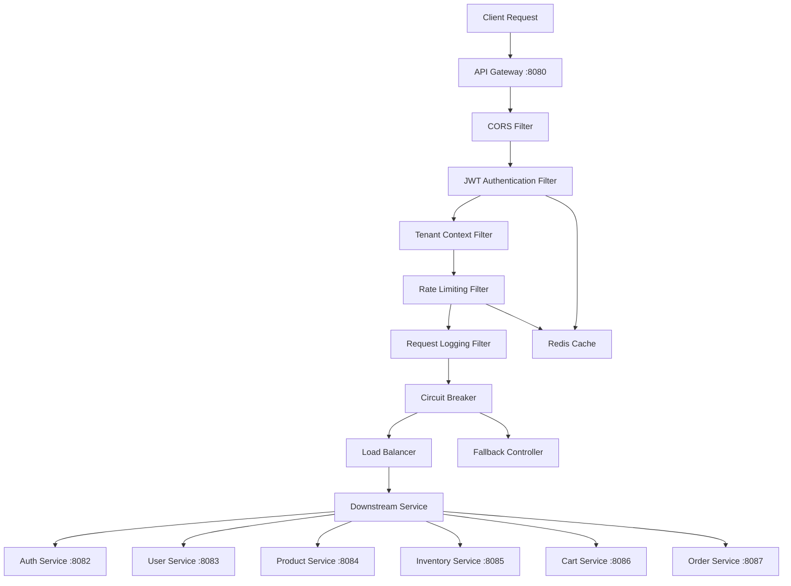

# API Gateway Service

## Overview

The API Gateway service acts as the single entry point for all client requests to the microservices backend. Built with Spring Cloud Gateway, it provides comprehensive authentication, authorization, rate limiting, circuit breaking, and intelligent request routing capabilities for the multi-tenant e-commerce platform.

**Port**: 8080  
**Technology**: Spring Cloud Gateway 4.0.x, Spring Security 6.2.x, Resilience4j  
**Status**: ✅ **Production Ready** (Task 6 Complete)

## 🚀 Features Implemented

### ✅ Advanced JWT Authentication & Authorization

- **JWT Token Validation**: Comprehensive token validation for all protected endpoints
- **Multi-Tenant Security**: Automatic tenant context extraction and validation
- **Role-Based Access Control**: User roles and permissions extraction from tokens
- **Public Path Management**: Smart exemptions for health checks, auth endpoints, and documentation
- **Token Refresh Support**: Seamless integration with refresh token flow
- **Security Headers**: Automatic security header injection (CORS, CSRF protection)

### ✅ Intelligent Rate Limiting

- **Redis-Based Rate Limiting**: High-performance rate limiting with Redis backend
- **Multi-Tier Rate Limiting**:
  - Default Tier: 1000 requests/minute
  - Premium Tier: 5000 requests/minute (enterprise tenants)
  - Burst Capacity: 2x rate limit for short bursts
- **Per-Tenant Isolation**: Separate rate limits per tenant
- **IP-Based Limiting**: Rate limiting for unauthenticated requests
- **Graceful Degradation**: Continues operation even if Redis is unavailable
- **Rate Limit Headers**: Client-friendly rate limit information in response headers

### ✅ Circuit Breaker & Resilience

- **Resilience4j Integration**: Advanced circuit breaker patterns for all downstream services
- **Service-Specific Configuration**: Tailored circuit breaker settings per service type
- **Fallback Responses**: Graceful degradation with meaningful fallback responses
- **Health Check Integration**: Automatic circuit breaker state management
- **Bulkhead Pattern**: Resource isolation between different service calls
- **Retry Logic**: Configurable retry with exponential backoff

### ✅ Comprehensive Observability

- **Structured Logging**: JSON-formatted logs with correlation IDs and tenant context
- **Request Tracing**: Complete request lifecycle tracking with performance metrics
- **Prometheus Metrics**: Detailed metrics for monitoring and alerting
- **Slow Request Detection**: Automatic detection and alerting for slow requests
- **Error Rate Monitoring**: Real-time error rate tracking per service
- **Custom Business Metrics**: Tenant-specific usage analytics

### ✅ Advanced Routing & Load Balancing

- **Declarative Configuration**: YAML-based route configuration with environment overrides
- **Dynamic Service Discovery**: Integration with service registry (prepared for Kubernetes)
- **Load Balancing**: Round-robin and weighted load balancing strategies
- **Path Rewriting**: Intelligent path transformation for downstream services
- **Protocol Translation**: REST to gRPC protocol translation (prepared)
- **CORS Management**: Comprehensive CORS configuration for web clients

### ✅ Security & Compliance

- **Tenant Isolation**: Strict tenant boundary enforcement
- **Request Sanitization**: Input validation and sanitization
- **Security Headers**: Automatic injection of security headers
- **Audit Logging**: Comprehensive audit trail for compliance
- **IP Whitelisting**: Support for IP-based access control (configurable)
- **DDoS Protection**: Basic DDoS protection through rate limiting

## 🏗️ Architecture

### Request Processing Pipeline



### Filter Chain Details

1. **CORS Filter**: Handles cross-origin requests with configurable policies
2. **JWT Authentication Filter**:
   - Validates JWT token signature and expiration
   - Extracts tenant ID, user ID, and roles
   - Sets security context for downstream processing
3. **Tenant Context Filter**:
   - Validates tenant access permissions
   - Propagates tenant context via headers
4. **Rate Limiting Filter**:
   - Checks Redis for current request count
   - Applies tenant-specific rate limits
   - Returns 429 Too Many Requests if exceeded
5. **Request Logging Filter**:
   - Generates correlation ID
   - Logs request details with tenant context
   - Measures request processing time
6. **Circuit Breaker**:
   - Monitors downstream service health
   - Fails fast when services are unavailable
   - Routes to fallback controllers when needed
7. **Load Balancer**:
   - Distributes requests across service instances
   - Health-aware routing

### Service Integration Matrix

| Service           | Port | Protocol  | Circuit Breaker    | Rate Limit | Auth Required |
| ----------------- | ---- | --------- | ------------------ | ---------- | ------------- |
| Auth Service      | 8082 | HTTP/gRPC | ✅ (60% threshold) | ❌         | ❌            |
| User Service      | 8083 | HTTP/gRPC | ✅ (50% threshold) | ✅         | ✅            |
| Product Service   | 8084 | HTTP/gRPC | ✅ (40% threshold) | ✅         | ✅            |
| Inventory Service | 8085 | HTTP/gRPC | ✅ (50% threshold) | ✅         | ✅            |
| Cart Service      | 8086 | HTTP/gRPC | ✅ (50% threshold) | ✅         | ✅            |
| Order Service     | 8087 | HTTP/gRPC | ✅ (30% threshold) | ✅         | ✅            |

## Configuration

### Environment Variables

- `REDIS_HOST`: Redis server host (default: localhost)
- `REDIS_PORT`: Redis server port (default: 6379)
- `AUTH_SERVICE_URL`: Authentication service URL
- `USER_SERVICE_URL`: User management service URL
- `PRODUCT_SERVICE_URL`: Product catalog service URL
- ... (and other service URLs)

### Circuit Breaker Settings

- **Default**: 50% failure rate threshold, 30s wait duration
- **Auth Service**: 60% failure rate (more lenient), 15s wait duration
- **Payment Service**: 30% failure rate (strict), 45s wait duration
- **Product Service**: 40% failure rate, 20s wait duration

### Rate Limiting

- **Default Tier**: 1000 requests per minute
- **Premium Tier**: 5000 requests per minute (for tenants with "premium*" or "enterprise*" prefix)
- **IP-based**: Same limits for unauthenticated requests

## Endpoints

### Health & Monitoring

- `GET /actuator/health` - Service health check
- `GET /actuator/metrics` - Prometheus metrics
- `GET /actuator/circuitbreakers` - Circuit breaker status

### Service Routes

- `/api/v1/auth/**` → Auth Service
- `/api/v1/users/**` → User Service
- `/api/v1/products/**` → Product Service
- `/api/v1/inventory/**` → Inventory Service
- `/api/v1/cart/**` → Cart Service
- `/api/v1/orders/**` → Order Service
- `/api/v1/payments/**` → Payment Service
- `/api/v1/shipping/**` → Shipping Service
- `/api/v1/notifications/**` → Notification Service
- `/api/v1/reviews/**` → Review Service

### Fallback Endpoints

- `/fallback/auth` - Auth service fallback
- `/fallback/user` - User service fallback
- `/fallback/product` - Product service fallback
- ... (and other service fallbacks)

## Headers

### Request Headers (Added by Gateway)

- `X-Correlation-ID`: Unique request identifier
- `X-Tenant-ID`: Extracted from JWT token
- `X-User-ID`: Extracted from JWT token
- `X-User-Roles`: Comma-separated list of user roles

### Response Headers (Rate Limiting)

- `X-RateLimit-Limit`: Rate limit threshold
- `X-RateLimit-Remaining`: Remaining requests
- `Retry-After`: Seconds to wait when rate limited

## Testing

The service includes comprehensive tests:

- Unit tests for individual filters
- Integration tests for complete request flows
- Fallback controller tests
- Circuit breaker behavior tests

Run tests with:

```bash
mvn test
```

## Monitoring

The gateway exposes metrics for:

- Request count and duration
- Circuit breaker states
- Rate limiting statistics
- JVM metrics
- Custom business metrics

Metrics are available at `/actuator/prometheus` for Prometheus scraping.

## Security

- JWT tokens are validated on every request
- Tenant isolation is enforced through token validation
- Rate limiting prevents abuse
- Circuit breakers prevent cascade failures
- Structured logging for audit trails

## Dependencies

- Spring Cloud Gateway
- Spring Security
- Resilience4j (Circuit Breaker)
- Spring Data Redis (Rate Limiting)
- Micrometer (Metrics)
- Auth0 JWT Library
